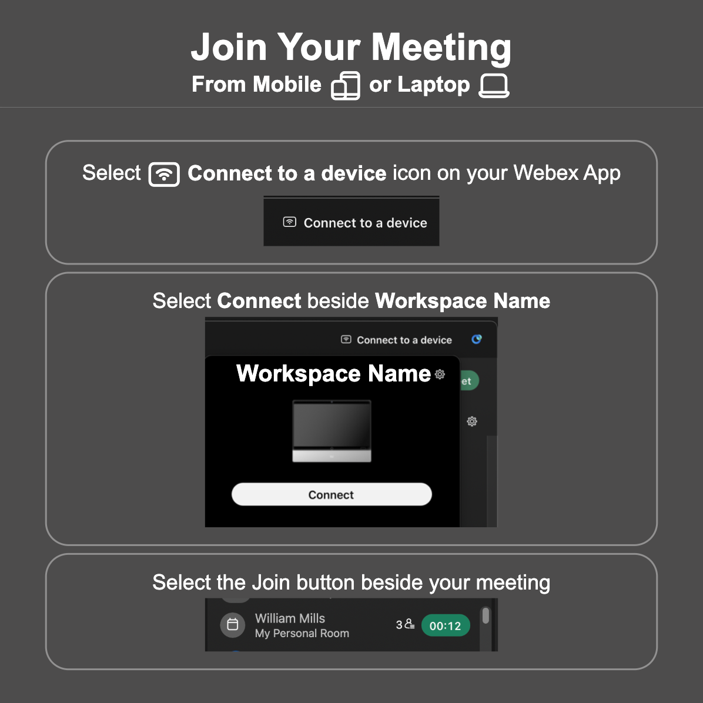

# Join Meeting Widget

This is an example Web Widget for Cisco Collaboration Devices which provides instructions on how to pair and join their meeting from their Webex App.

<p align="center">
  
</p>

## Overview

This Web Widget helps uses understand how to join their Web Meetings without having to scan a QR code or look for the user guides. Simply save the Widget to your Collaboration Device and it will be displayed at all times when not in a call/meeting and out of standby or halfwake.

Optional: The workspaces name displayed in this example Web Widget can be customised by specifying the Workspaces name as a URL Hash Parameter.


## Setup

### Prerequisites & Dependencies: 

- RoomOS 11.6.x or above Cisco Collaboration Device
- Control Hub Device Admin or Local Web Admin access to your Collaboration Device
- (optional) Web Server - Used for hosting your own copy of this Web Widget


### Installation Steps:
1.  Log into your devices local web admin interface
2.  Click the UI Extension editor
3.  Click the ``New`` button to create a new extension and select ``Add`` under the Web Widget option
4.  Enter the following URL under the ``Web widget URL`` field
    ```
    https://wxsd-sales.github.io/roomos-webapps/join-meeting-widget
    ```

    (optional) Set the name of devices workspace name as a URL hash parameter to customise the displayed name
     ```
    https://wxsd-sales.github.io/roomos-webapps/join-meeting-widget#deviceName=<My Workspace Name>
    ```
5.  Click the blue upload icon at the top right of the UI Extension editor to save the new Widget to your device.
    
    
    
## Demo

Check out our live demo, available [here](https://wxsd-sales.github.io/roomos-webapps/join-meeting-widget)!

*For more demos & PoCs like this, check out our [Webex Labs site](https://collabtoolbox.cisco.com/webex-labs).


## License

All contents are licensed under the MIT license. Please see [license](LICENSE) for details.


## Disclaimer

Everything included is for demo and Proof of Concept purposes only. Use of the site is solely at your own risk. This site may contain links to third party content, which we do not warrant, endorse, or assume liability for. These demos are for Cisco Webex use cases, but are not Official Cisco Webex Branded demos.


## Questions
Please contact the WXSD team at [wxsd@external.cisco.com](mailto:wxsd@external.cisco.com?subject=RepoName) for questions. Or, if you're a Cisco internal employee, reach out to us on the Webex App via our bot (globalexpert@webex.bot). In the "Engagement Type" field, choose the "API/SDK Proof of Concept Integration Development" option to make sure you reach our team. 
